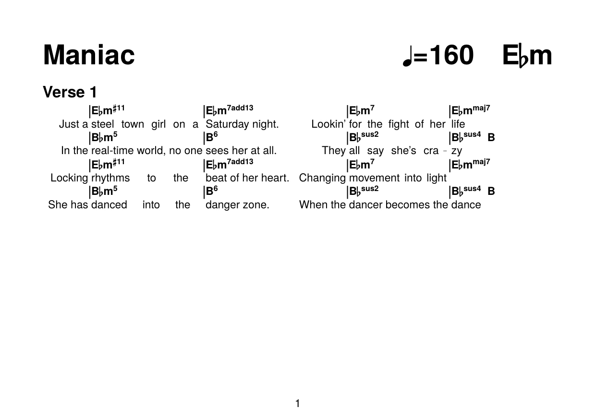

# Leadsheet

A Python library and LaTeX document class for creating professional musical leadsheets with integrated chord symbols, lyrics, barlines, and sectional structure.

## Features

- **Chord Notation**: Simple syntax for chord symbols (`^Cm7`, `^F#maj9/A`)
- **Chord Progressions**: Define reusable chord progressions with named references
- **Barlines**: Automatic formatting of regular (`|`) and repeat barlines (`||:`, `:||`)
- **Song Sections**: Environments for verses, choruses, bridges with optional highlighting
- **Flexible Layout**: Automatic spacing and alignment for professional appearance
- **Python CLI**: Compile `.tex` leadsheets to PDF from the command line

## Quick Start

### Compile a leadsheet

```bash
# Compile to PDF (same directory as input)
python -m leadsheet my_song.tex

# Specify output path
python -m leadsheet my_song.tex output/my_song.pdf

# Use a different LaTeX engine
python -m leadsheet my_song.tex --engine xelatex
```

### Use as a Python library

```python
from leadsheet import compile_latex

output = compile_latex("my_song.tex", "output/my_song.pdf")
print(f"Compiled to {output}")
```

### Write a leadsheet

```latex
\documentclass{leadsheet}
\geometry{a5paper,landscape}

\title{Maniac}
\key{Ebm}
\tempo{160}

\begin{chordprogression}{Verse A}
    |^Ebm#11 >> & |^Ebm7add13 >> & |^Ebm7 >> & |^Ebmmaj7 >>
\end{chordprogression}

\begin{document}
\maketitle

\begin{songsection}{Verse 1}
    & ^{Verse A} \\
    <> Just a & steel town girl on a & Saturday night. <> Lookin' & for the fight of her & life \\
\end{songsection}

\end{document}
```




## Installation

Requires [uv](https://docs.astral.sh/uv/) for package management.

```bash
git clone https://github.com/yourname/leadsheet
cd leadsheet
just setup
```

Or install directly:

```bash
uv add leadsheet
```

## Development

### Prerequisites

- [uv](https://docs.astral.sh/uv/) — Python package manager
- [just](https://just.systems/) — command runner
- A TeX distribution with LuaLaTeX and `latexmk` (e.g. [TeX Live](https://tug.org/texlive/), [MiKTeX](https://miktex.org/))
- ImageMagick (`magick`) — optional, only required for `just example-png`

### Common commands

```bash
just setup        # Install dependencies
just test         # Run the test suite
just lint         # Check for lint issues
just format       # Auto-fix and format
just example      # Build examples/maniac.pdf and examples/maniac.png
just build        # Build wheel and sdist
```

## LaTeX Syntax Reference

### Chord Notation

Within `lstabular` or song section environments:

| Syntax | Meaning |
|---|---|
| `^Cm7` | C minor 7th chord |
| `^F#maj9` | F# major 9th chord |
| `^Dm7/A` | D minor 7th, A in bass |
| `^{Verse}` | Reference a named chord progression |
| `^!{text}` | Custom annotation |
| `^nC` | "No chord" annotation |

### Barlines

| Syntax | Meaning |
|---|---|
| `\|` | Regular barline |
| `\|\|:` | Repeat start |
| `:\|\|` | Repeat end |

### Special Syntax

| Syntax | Meaning |
|---|---|
| `<>` | Infinite fill space (push content apart) |
| `- &` | Join table cells with dashes |
| `>>` | Medium space after a chord |
| `>>>` | Large space after a chord |

### Chord Progressions

Define once, reuse anywhere:

```latex
\begin{chordprogression}{Intro}
    |^Cm7 & ^F7 & ^Bb & ^Eb
\end{chordprogression}

\begin{songsection}{Intro}
    & ^{Intro} \\
    <> & Instrumental \\
\end{songsection}
```

## Requirements

- Python >= 3.12
- LuaLaTeX (recommended) or XeLaTeX
- TeX Gyre Heros font (usually bundled with TeX distributions)
- LaTeX packages: `fontspec`, `expl3`, `mdframed`, `soul`, `array`, `geometry`, `microtype`

## Project Structure

```
leadsheet/
├── leadsheet/          # Python package
│   ├── __init__.py
│   ├── __main__.py     # CLI entry point
│   ├── compiler.py     # Compilation engine
│   └── latex/          # Bundled LaTeX class files (package data)
├── latex/              # LaTeX source files (canonical)
│   ├── leadsheet.cls
│   ├── leadsheet-core.sty
│   ├── leadsheet-chords.sty
│   └── leadsheet-sections.sty
├── examples/           # Example leadsheets
│   └── maniac.tex
├── tests/              # Test suite
│   ├── conftest.py
│   └── test_compiler.py
├── pyproject.toml
└── justfile
```

## License

[Add your license information here]

## Author

[Add your author information here]
